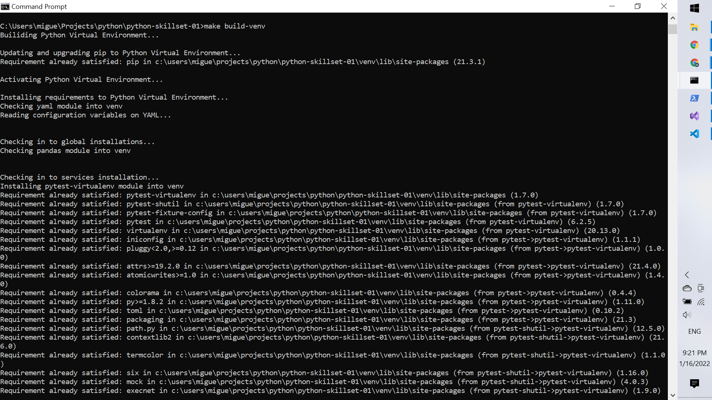

# Python Quick Demonstration (Windows operating system)

Python development, and ar

## Needed installs

### First Step

Install Chocolatey into your computer:
1. Open Powershell with administrative privileges
2. Run the following code:
```bash
Set-ExecutionPolicy Bypass -Scope Process -Force; [System.Net.ServicePointManager]::SecurityProtocol = [System.Net.ServicePointManager]::SecurityProtocol -bor 3072; iex ((New-Object System.Net.WebClient).DownloadString('https://community.chocolatey.org/install.ps1'))
```

For more information about this package manager, please direct to: https://www.github.com/miguelestradam36/chocolatey-for-windows 

### Second Step

**NOTE:** Once Chocolatey has been installed.
1. In the same window/session
2. Execute the following commands:

```bash
chocho install make
```

## How to use ?

For a first use, to automatically create the Python virtual Environment with all its functionalities, execute the command:

```bash
make build-venv
```



## Documentation 
To be directed to the docs main readme
- Press the following link: [Docs](docs/)

#### For more specific information:

- AWS: [further documentation](docs/AWS.md)
- Azure: [further documentation](docs/Azure.md)
- Snowflake: [further documentation](docs/Snowflake.md)
- Python: [further documentation](docs/Python.md)
- Makefile: [further documentation](docs/Makefile.md)

#### Author:

- Miguel Estrada